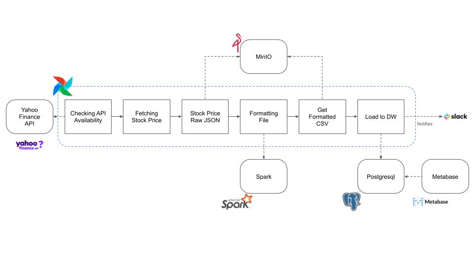

# stock-market-analytics-engineer-project

## Introduction 
This project aims to perform end-to-end data engineer analytics on the Yahoo! Stock Market API using various tools and technologies, including Astro CLI, Airflow, PostgreSQL, Min.io (AWS S3 Like Data Storage), Spark, and Metabase. 

Executive summary: 

🔧 What I do:

    📥 Data ingestion from Yahoo Stock Market API 
        🔎 Checking the API Availability 
        📨 Fetching the Stock Market Price from API 
    🦜 Store the Stock Market Price file into Minio 
    ♻️ Transform and format the data with Spark 
    💾 Load data into PostgreSQL  
    📊 Create a dashboard and analyze the data with Metabase

## Tools 
🔧 Tools I used in this project:
 
    💫 Astronomer CLI 
    🪁 Apache Airflow
    🦜 Min.io  
    🐘 PostgreSQL 
    ✨ Spark 
    📊 Metabase 

## 📂 Project Structure
```bash
├── dags/                               # Airflow DAGs Pipeline Collection
├── include/                            # Locale module 
│   ├── data/, minio                    # Storage for raw and formatted file
│   └── stock_market/                   # Tasks Collection 
├── spark/, master/, notebook/, /worker # Spark ecosystem 
├── img/                                # Project screenshots
├── docker-compose.override.yml         # Docker compose file 
├── requirement.txt                     # Requirement file to include minio and airflow providers 
└── README.md
```

## Architecture 
🏛️ The architecture I used in this project: 

